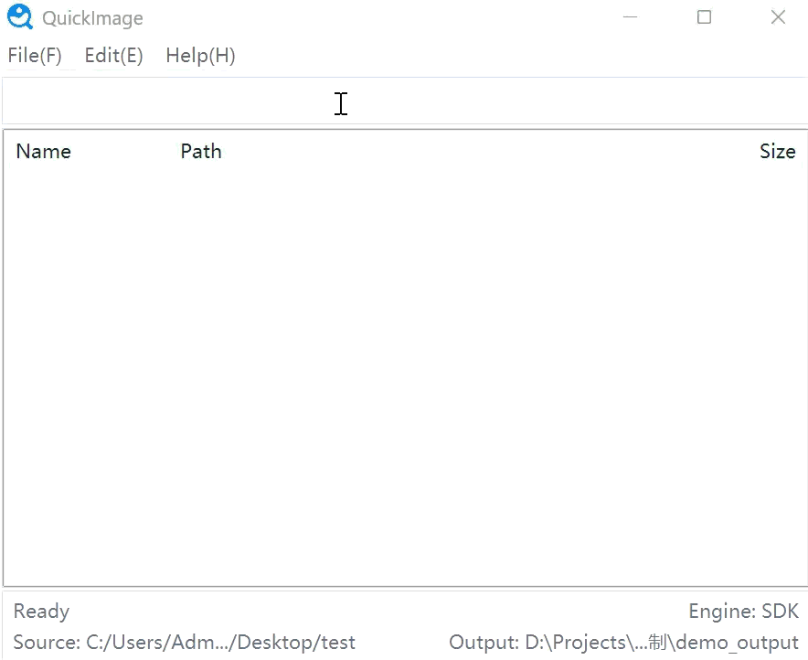

# QuickImage

Windows 下的极速图片搜索复制工具（基于 Everything）。

<p align="center">
  <a href="README.md">English</a> | <strong>简体中文</strong>
</p>

English documentation: [README.md](README.md)



---

## 这是什么

QuickImage 用来做一件事：

**输入图片名 -> 立即搜到 -> 一键复制到指定目录。**

适合 JIT 取图、样图整理、批量补图等日常场景。

---

## 核心特点

- **输入即搜**：输入文件名就实时出结果
- **精确匹配**：按文件名精确匹配（不含扩展名）
- **多关键词**：支持一次输入多个名字（空格分隔）
- **保存目录可自定义**：不再固定到桌面
- **自动创建目录**：保存目录不存在会自动创建
- **引擎自动切换**：优先 SDK，失败自动回退 `es.exe`
- **中英文切换**：`文件 -> 语言 -> 中文/English`

---

## 环境要求

| 项目 | 说明 |
|---|---|
| 系统 | Windows 10 / 11 |
| 搜索引擎 | 首次启动时可由程序自动下载并安装 [Everything](https://www.voidtools.com/) |
| Python | 3.8+（源码运行时） |
| SDK（自动） | 程序会自动下载 SDK 加速组件，用户无需手动处理 |

> 不需要手动下载 SDK。程序会在首次启动时自动准备加速组件，失败时也会自动回退到 `es.exe`。

---

## 快速开始（源码运行）

1. 安装 Everything（建议勾选 `es.exe` 命令行组件）
2. 进入项目目录后运行：

```bash
python main.pyw
```

3. 首次打开后：
   - 如果本机还没有 Everything，程序会先弹出双语引导，并帮你自动下载安装
   - `文件 -> 设置源目录`
   - `文件 -> 设置保存目录（可选）`

> 语言菜单已改成双语显示：`语言 / Language`，英文用户也能直接找到。

---

## SDK 加速

普通用户不需要手动处理 SDK。

程序首次启动时会自动：

- 检测是否已有 SDK
- 没有时自动从 voidtools 官方下载
- 自动放到程序可识别的位置
- 如果失败则自动回退到 `es.exe`

只有开发者想手动调试时，才需要关心 DLL 文件位置。

如果你后续想重新检查，也可以在菜单里手动点击：

- `文件 -> 检查搜索组件 / Check Search Components`

---

## 使用方法

1. 在输入框输入图片名（多个名字用空格分开）
2. 结果会实时显示在列表中
3. 按 `Enter` 或 `Ctrl+C` 复制结果到保存目录

---

## 快捷键

| 按键 | 功能 |
|---|---|
| `Enter` / `Ctrl+C` | 复制当前结果 |
| `Ctrl+A` | 全选列表 |
| `T` | 切换窗口置顶 |

---

## 如何确认是否在用 SDK

看窗口底部状态栏：

- 显示 **`引擎: SDK`** -> 当前正在使用 SDK
- 显示 **`引擎: es.exe`** -> 当前使用命令行模式（自动回退）

---

## 配置文件位置

程序配置默认保存在：

- `C:\Users\你的用户名\.image_search_config.json`

会自动记住：

- 源目录
- 保存目录
- 窗口位置
- 语言设置

---

## 许可证

MIT License - 详见 `LICENSE`

---

**© NerionX**
